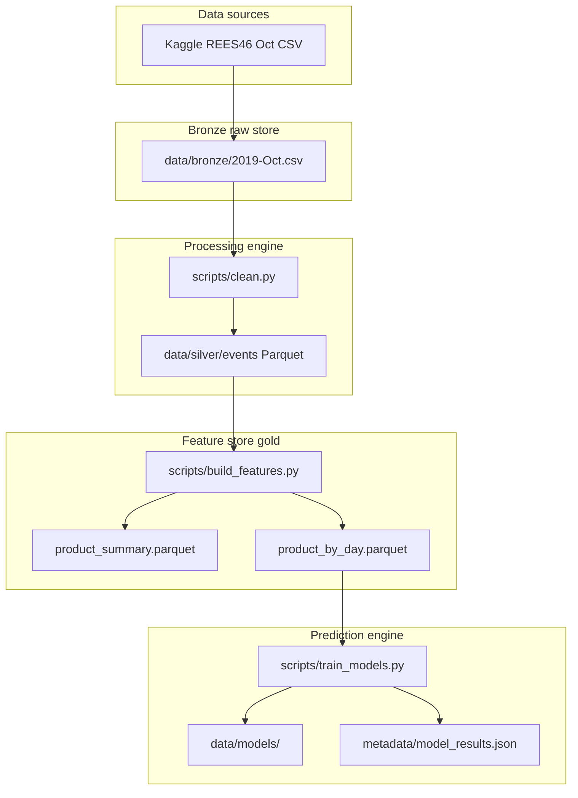

# Figure: System architecture

Use in Methodology chapter. Export to PNG via Mermaid Live or VS Code extension.

**Caption:** Batch architecture — raw clickstream → cleaned events → product-day features → model training and evaluation. API and real-time workers are out of scope.
