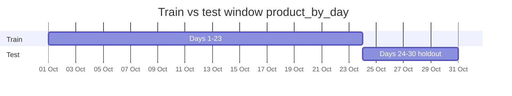

# Figure: Evaluation strategy (temporal split)

October 2019 calendar window — no random row split.

| Setting | Value |
|---------|-------|
| Train | First 23 unique calendar dates with a valid target (Oct 1–23) |
| Test | Next 7 dates (Oct 24–30); Oct 31 has no `purchases_next_day` label |
| Target | `purchases_next_day` |
| Metrics | MAE (primary), RMSE, MAPE, R² |
| Why not random split? | Prevents leakage from future dates into training |

All models (baselines + RF + XGBoost + LightGBM) use the **same** date boundary.

**Caption:** Time-based holdout — models trained on early October, evaluated on the final week.
