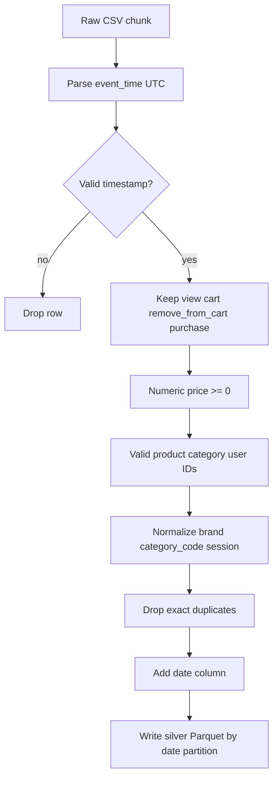

# Figure: Preprocessing flow (silver layer)

From `src/cleaning.py` — decision rules applied per chunk.

**Caption:** Silver-layer cleaning rules — invalid timestamps, event types, prices, and IDs are removed; duplicates dropped; events partitioned by date.
