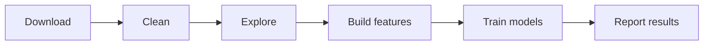

# Figure: End-to-end workflow

| Step | Purpose | Output |
|------|---------|--------|
| Download | Ingest October clickstream | Bronze raw data |
| Clean | Validate and partition events | Silver cleaned events |
| Explore | EDA summaries and charts | Activity and funnel insights |
| Build features | Product-day aggregation | Gold feature tables |
| Train | Baselines + tree models | Metrics and model artifacts |

**Caption:** Pipeline stages and outputs at each step.
