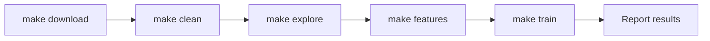

# Figure: End-to-end workflow

Maps to Makefile targets.

| Step | Script | Output |
|------|--------|--------|
| download | `scripts/download.py` | `data/bronze/` |
| clean | `scripts/clean.py` | `data/silver/events/` |
| explore | `scripts/explore.py` | `metadata/eda_summary.json`, figures |
| features | `scripts/build_features.py` | `data/gold/*.parquet` |
| train | `scripts/train_models.py` | `metadata/model_results.json`, `data/models/` |

**Caption:** Pipeline stages and artifacts produced at each step.
